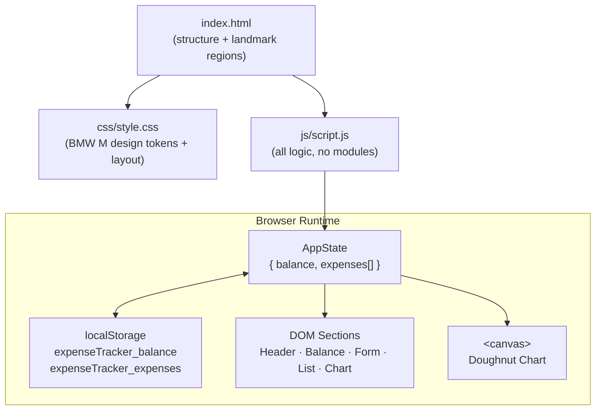
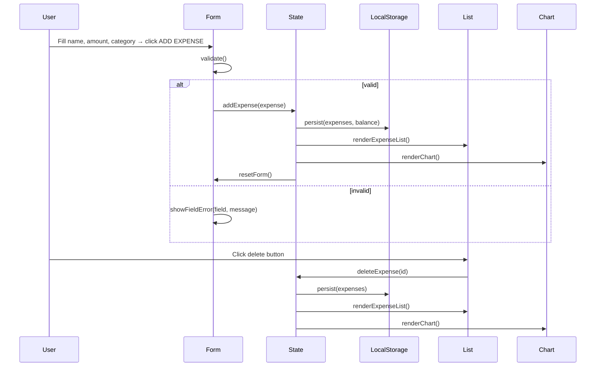
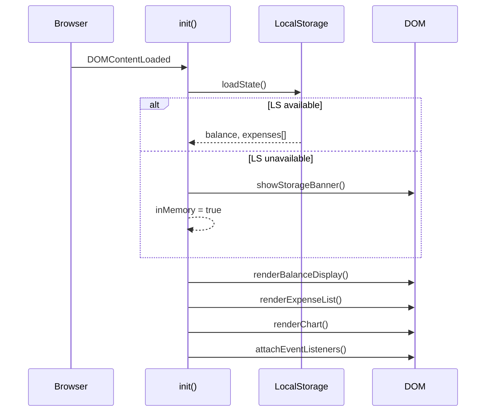

# Design Document: Expense Tracker

## Overview

A single-page, zero-dependency expense tracker delivered as three static files (`index.html`, `css/style.css`, `js/script.js`). All state lives in the browser's `localStorage`; no server, no build step, no framework. The visual language is BMW M: absolute black canvas, white type, M tricolor accents (blue → dark blue → red), zero border-radius, uppercase letterspaced labels.

The application is divided into five rendered sections — Header, Balance, Expense Form, Expense List, Chart — orchestrated by a thin state manager that keeps the DOM, localStorage, and the Canvas chart in sync on every mutation.

---

## Architecture

### High-Level Component Diagram



### Data Flow



### Page Load Sequence



---

## File Structure

```
project-root/
├── index.html          ← markup, landmark regions, canvas element
├── css/
│   └── style.css       ← design tokens, layout, component styles
└── js/
    └── script.js       ← all application logic (single IIFE)
```

No external scripts, no CDN links, no web fonts loaded from the network. `BMW Type Next Latin` is referenced as a `font-face` declaration pointing to a local system font stack; fallback is `Inter, system-ui, sans-serif`.

---

## HTML Structure

```html
<!DOCTYPE html>
<html lang="en">
<head>
  <meta charset="UTF-8" />
  <meta name="viewport" content="width=device-width, initial-scale=1.0" />
  <title>Expense Tracker</title>
  <link rel="stylesheet" href="css/style.css" />
</head>
<body>

  <!-- Storage warning banner (hidden by default) -->
  <div id="storage-banner" class="storage-banner" role="alert" hidden>
    LOCAL STORAGE UNAVAILABLE — DATA WILL NOT BE SAVED
    <button id="dismiss-banner" aria-label="Dismiss warning">✕</button>
  </div>

  <!-- R2: Header -->
  <header id="app-header">
    <div class="m-tricolor" aria-hidden="true">
      <span class="bar bar--blue"></span>
      <span class="bar bar--darkblue"></span>
      <span class="bar bar--red"></span>
    </div>
    <h1>EXPENSE TRACKER</h1>
  </header>

  <main>

    <!-- R3: Balance -->
    <section id="balance-section" aria-labelledby="balance-heading">
      <h2 id="balance-heading">BALANCE</h2>
      <p id="balance-display" aria-live="polite">Rp 0</p>
      <form id="balance-form" novalidate>
        <label for="balance-input">SET BALANCE</label>
        <input id="balance-input" type="number" min="1" max="999999999"
               autocomplete="off" inputmode="numeric" />
        <span id="balance-error" class="field-error" role="alert" aria-live="assertive"></span>
        <button type="submit">SET BALANCE</button>
      </form>
    </section>

    <!-- R4: Expense Form -->
    <section id="form-section" aria-labelledby="form-heading">
      <h2 id="form-heading">ADD EXPENSE</h2>
      <form id="expense-form" novalidate>

        <label for="expense-name">ITEM NAME</label>
        <input id="expense-name" type="text" maxlength="250" autocomplete="off" />
        <span id="name-error" class="field-error" role="alert" aria-live="assertive"></span>

        <label for="expense-amount">AMOUNT</label>
        <input id="expense-amount" type="number" min="0.01" step="0.01"
               autocomplete="off" inputmode="decimal" />
        <span id="amount-error" class="field-error" role="alert" aria-live="assertive"></span>

        <label id="category-label">CATEGORY</label>
        <div id="category-tabs" role="group" aria-labelledby="category-label">
          <!-- Rendered by JS: one <button type="button"> per category -->
        </div>
        <input type="hidden" id="expense-category" value="Food" />

        <button type="submit">ADD EXPENSE</button>
      </form>
    </section>

    <!-- R5: Expense List -->
    <section id="list-section" aria-labelledby="list-heading">
      <h2 id="list-heading">EXPENSE HISTORY</h2>
      <ul id="expense-list" aria-label="Expense history">
        <!-- Rendered by JS -->
      </ul>
    </section>

    <!-- R6: Chart -->
    <section id="chart-section" aria-labelledby="chart-heading">
      <h2 id="chart-heading">SPEND BREAKDOWN</h2>
      <canvas id="expense-chart" width="300" height="300"
              aria-label="Expense breakdown by category"></canvas>
      <ul id="chart-legend" aria-label="Chart legend">
        <!-- Rendered by JS -->
      </ul>
    </section>

  </main>

  <script src="js/script.js"></script>
</body>
</html>
```

---

## Data Models

### Expense Object

```javascript
/**
 * @typedef {Object} Expense
 * @property {string}  id        - Unique identifier (crypto.randomUUID() or fallback)
 * @property {string}  name      - Item name, 1–250 characters
 * @property {number}  amount    - Positive number, max 999999999.99
 * @property {string}  category  - One of CATEGORIES keys
 * @property {number}  timestamp - Unix ms (Date.now()) at creation time
 */
```

### AppState Object

```javascript
/**
 * @typedef {Object} AppState
 * @property {number}    balance   - User-set budget (default 0)
 * @property {Expense[]} expenses  - All recorded expenses, newest first
 */
```

### LocalStorage Keys

| Key | Type | Description |
|-----|------|-------------|
| `expenseTracker_balance` | `string` (serialized number) | User-set balance |
| `expenseTracker_expenses` | `string` (JSON array) | Array of Expense objects |

### Category Color Palette

```javascript
const CATEGORIES = {
  Food:          { color: '#0066b1' },
  Transport:     { color: '#1c69d4' },
  Entertainment: { color: '#e22718' },
  Shopping:      { color: '#f4b400' },
  Health:        { color: '#0fa336' },
  Other:         { color: '#7e7e7e' },
};
```

---

## Components and Interfaces

### Component 1: StateManager (logical)

**Purpose**: Single source of truth for all mutable data. No class — just the `state` object plus the functions that read/write it.

**Interface**:
```javascript
// Read
function computeRemainingBalance() /* → number */
function getExpenses()             /* → Expense[] */
function getBalance()              /* → number */

// Write (each mutates state, persists to LS, triggers re-render)
function setBalance(amount)        /* → void */
function addExpense(expense)       /* → void */
function deleteExpense(id)         /* → void */
```

**Responsibilities**:
- Maintain `state.balance` and `state.expenses`
- Delegate persistence to `persistState()`
- Trigger `renderBalanceDisplay()`, `renderExpenseList()`, `renderChart()` after each mutation

---

### Component 2: LocalStorageAdapter

**Purpose**: Isolate all localStorage I/O and guard against unavailability or corrupt data.

**Interface**:
```javascript
function checkStorageAvailable() /* → boolean */
function loadState()             /* → void  (populates state, shows banner on error) */
function persistState()          /* → void  (no-op when storageAvailable === false) */
```

**Responsibilities**:
- Test localStorage availability once at startup
- Parse JSON safely, falling back to empty defaults on failure
- Show the storage warning banner when a read/write error occurs

---

### Component 3: Validator

**Purpose**: Pure functions that validate user input before state mutations.

**Interface**:
```javascript
function validateBalance(raw)
/* → { valid: boolean, value?: number, error?: string } */

function validateExpense(name, rawAmount, category)
/* → { valid: boolean, errors: { name?: string, amount?: string } } */
```

**Responsibilities**:
- Enforce numeric range checks for balance and amount
- Enforce string length checks for item name
- Return structured result objects (never mutate DOM directly)

---

### Component 4: FormController

**Purpose**: Handle all DOM events from the balance form and expense form.

**Interface**:
```javascript
function handleSetBalance(e)       /* SubmitEvent → void */
function handleAddExpense(e)       /* SubmitEvent → void */
function handleCategoryTab(cat)    /* string → void */
function showFieldError(id, msg)   /* (string, string) → void */
function clearFieldError(id)       /* string → void */
```

**Responsibilities**:
- Call validators and surface inline errors
- Invoke StateManager write functions on valid input
- Reset form fields after successful submission

---

### Component 5: ExpenseListRenderer

**Purpose**: Produce the expense history list DOM from `state.expenses`.

**Interface**:
```javascript
function renderExpenseList()      /* → void */
function buildExpenseRow(expense) /* Expense → HTMLLIElement */
```

**Responsibilities**:
- Clear and rebuild `#expense-list` on every call
- Show empty-state placeholder when list is empty
- Attach delete buttons with correct `aria-label` and `data-id`
- Delegate delete events via event delegation on the list container

---

### Component 6: ChartRenderer

**Purpose**: Draw the doughnut chart and rebuild the legend on every data change.

**Interface**:
```javascript
function initCanvas(canvas)  /* HTMLCanvasElement → void  (DPR scaling) */
function renderChart()       /* → void */
function renderLegend(activeCategories) /* CategoryEntry[] → void */
function drawCenteredText(ctx, text, cx, cy) /* → void */
```

**Responsibilities**:
- Aggregate per-category totals from `state.expenses`
- Draw filled ring segments using Canvas arc paths
- Show "NO DATA" text when no expenses exist
- Update `canvas.aria-label` with current category totals after each render

---

## CSS Design Tokens

```css
:root {
  /* Color palette */
  --color-bg:          #000000;
  --color-surface:     #111111;
  --color-border:      #2a2a2a;
  --color-text-primary:#ffffff;
  --color-text-muted:  #7e7e7e;
  --color-m-blue:      #0066b1;
  --color-m-darkblue:  #1c69d4;
  --color-m-red:       #e22718;
  --color-negative:    #e22718;

  /* Typography */
  --font-family:       'BMW Type Next Latin', Inter, system-ui, sans-serif;
  --font-weight-bold:  700;
  --font-weight-light: 300;
  --letter-spacing-ui: 0.1em;

  /* Spacing scale */
  --space-xs: 4px;
  --space-sm: 8px;
  --space-md: 16px;
  --space-lg: 24px;
  --space-xl: 40px;

  /* Borders — zero radius everywhere */
  --border-radius: 0;
  --border-width:  1px;
}
```

---

## Module Breakdown (`js/script.js`)

The entire script is wrapped in a single IIFE to avoid global scope pollution. Sections are delineated by comment banners.

```
(function () {
  // ─── 1. CONSTANTS ──────────────────────────────────────────────
  // ─── 2. STATE ──────────────────────────────────────────────────
  // ─── 3. LOCALSTORAGE HELPERS ───────────────────────────────────
  // ─── 4. FORMATTING HELPERS ─────────────────────────────────────
  // ─── 5. VALIDATION ─────────────────────────────────────────────
  // ─── 6. DOM RENDERERS ──────────────────────────────────────────
  //    6a. renderBalanceDisplay()
  //    6b. renderCategoryTabs()
  //    6c. renderExpenseList()
  //    6d. renderChart()
  // ─── 7. EVENT HANDLERS ─────────────────────────────────────────
  //    7a. handleSetBalance()
  //    7b. handleAddExpense()
  //    7c. handleDeleteExpense()
  //    7d. handleCategoryTab()
  // ─── 8. INIT ───────────────────────────────────────────────────
})();
```

---

## Key Function Signatures

### 1. Constants & Config

```javascript
const LS_KEY_BALANCE  = 'expenseTracker_balance';
const LS_KEY_EXPENSES = 'expenseTracker_expenses';
const DEFAULT_LOCALE  = 'id-ID';
const DEFAULT_CURRENCY = 'IDR';
const MAX_BALANCE     = 999_999_999;
const MAX_AMOUNT      = 999_999_999.99;
const MAX_NAME_LEN    = 250;
const LIST_TRUNCATE   = 40;
```

### 2. State

```javascript
let state = {
  balance:  0,
  expenses: [],   // newest-first order maintained at insertion
};
let storageAvailable = true;
```

### 3. LocalStorage Helpers

```javascript
/**
 * Test localStorage availability once at startup.
 * @returns {boolean}
 */
function checkStorageAvailable() {}

/**
 * Persist current state to localStorage.
 * No-op (with banner already shown) if storageAvailable === false.
 */
function persistState() {}

/**
 * Load balance and expenses from localStorage into state.
 * Handles missing keys and JSON parse failures per R7-AC3/AC5.
 */
function loadState() {}
```

### 4. Formatting Helpers

```javascript
/**
 * Format a number as a locale currency string.
 * @param {number} value
 * @returns {string}  e.g. "Rp 500.000"
 */
function formatCurrency(value) {
  return new Intl.NumberFormat(DEFAULT_LOCALE, {
    style:    'currency',
    currency: DEFAULT_CURRENCY,
    minimumFractionDigits: 0,
    maximumFractionDigits: 2,
  }).format(value);
}

/**
 * Truncate a string to maxLen characters, appending '…' if truncated.
 * @param {string} str
 * @param {number} maxLen
 * @returns {string}
 */
function truncate(str, maxLen) {}

/**
 * Generate a unique ID.
 * Uses crypto.randomUUID() when available, otherwise a timestamp+random fallback.
 * @returns {string}
 */
function generateId() {
  return (typeof crypto !== 'undefined' && crypto.randomUUID)
    ? crypto.randomUUID()
    : `${Date.now()}-${Math.random().toString(36).slice(2)}`;
}
```

### 5. Validation

```javascript
/**
 * Validate balance input.
 * @param {string} raw - Raw string from input element
 * @returns {{ valid: boolean, value?: number, error?: string }}
 */
function validateBalance(raw) {}

/**
 * Validate expense form inputs.
 * @param {string} name
 * @param {string} rawAmount
 * @param {string} category
 * @returns {{ valid: boolean, errors: { name?: string, amount?: string } }}
 */
function validateExpense(name, rawAmount, category) {}
```

### 6. DOM Renderers

```javascript
/**
 * Render the balance display value.
 * Applies --color-negative class when remaining balance < 0.
 */
function renderBalanceDisplay() {}

/**
 * Render category tab buttons inside #category-tabs.
 * Called once during init.
 */
function renderCategoryTabs() {}

/**
 * Re-render the full expense list from state.expenses.
 * Shows placeholder when list is empty.
 */
function renderExpenseList() {}

/**
 * Re-render the doughnut chart and legend from state.expenses.
 */
function renderChart() {}
```

### 7. Event Handlers

```javascript
/**
 * Handle balance form submission.
 * @param {SubmitEvent} e
 */
function handleSetBalance(e) {}

/**
 * Handle expense form submission.
 * @param {SubmitEvent} e
 */
function handleAddExpense(e) {}

/**
 * Handle delete button click (event delegation on #expense-list).
 * @param {MouseEvent} e
 */
function handleDeleteExpense(e) {}

/**
 * Handle category tab button click.
 * Updates hidden input and active tab styling.
 * @param {string} category
 */
function handleCategoryTab(category) {}
```

### 8. Init

```javascript
/**
 * Entry point. Called on DOMContentLoaded.
 * Order: checkStorage → loadState → renderAll → attachListeners
 */
function init() {}

document.addEventListener('DOMContentLoaded', init);
```

---

## Algorithms

### Derived Balance Calculation

The displayed balance is never stored directly; it is always computed:

```javascript
// Precondition:  state.balance >= 0, state.expenses is a valid array
// Postcondition: returns (state.balance - sum of all expense amounts)
function computeRemainingBalance() {
  return state.expenses.reduce((sum, e) => sum - e.amount, state.balance);
}
```

### Expense List Rendering

```
ALGORITHM renderExpenseList
INPUT:  state.expenses (array, newest-first)
OUTPUT: side-effect — #expense-list DOM updated

BEGIN
  list ← document.getElementById('expense-list')
  list.innerHTML ← ''

  IF state.expenses is empty THEN
    append <li class="empty-state">NO EXPENSES RECORDED YET</li>
    RETURN
  END IF

  FOR each expense IN state.expenses DO
    row ← buildExpenseRow(expense)
    list.appendChild(row)
  END FOR
END
```

Each row is constructed as:

```javascript
function buildExpenseRow(expense) {
  const li   = document.createElement('li');
  li.dataset.id = expense.id;

  const nameEl   = document.createElement('span');
  nameEl.textContent = truncate(expense.name, LIST_TRUNCATE);

  const badge    = document.createElement('span');
  badge.className = 'category-badge';
  badge.textContent = expense.category;
  badge.style.backgroundColor = CATEGORIES[expense.category].color;

  const amountEl = document.createElement('span');
  amountEl.textContent = formatCurrency(expense.amount);

  const delBtn   = document.createElement('button');
  delBtn.type = 'button';
  delBtn.className = 'delete-btn';
  delBtn.setAttribute('aria-label', `Delete expense: ${expense.name}`);
  delBtn.textContent = '✕';

  li.append(nameEl, badge, amountEl, delBtn);
  return li;
}
```

### Chart Rendering Algorithm (Canvas API)

The chart section uses a single `<canvas>` element. `renderChart()` is the sole function that writes to it.

```
ALGORITHM renderChart
INPUT:  state.expenses (array)
OUTPUT: side-effect — canvas redrawn, legend DOM updated, aria-label updated

CONSTANTS:
  CX, CY  ← canvas.width / 2, canvas.height / 2
  OUTER_R ← Math.min(CX, CY) * 0.85
  INNER_R ← OUTER_R * 0.55       (doughnut hole)
  GAP     ← 0.02 radians          (visual gap between arcs)

BEGIN
  ctx ← canvas.getContext('2d')
  ctx.clearRect(0, 0, canvas.width, canvas.height)

  // 1. Aggregate spend per category
  totals ← {}
  FOR each expense IN state.expenses DO
    totals[expense.category] += expense.amount
  END FOR

  activeCategories ← entries of totals WHERE amount > 0

  // 2. Empty state
  IF activeCategories is empty THEN
    drawCenteredText(ctx, 'NO DATA', CX, CY)
    clearLegend()
    canvas.setAttribute('aria-label', 'Expense breakdown: no data')
    RETURN
  END IF

  // 3. Calculate total for proportions
  grandTotal ← sum of all activeCategories amounts

  // 4. Draw arcs
  startAngle ← -Math.PI / 2     (12 o'clock position)
  FOR each { category, amount } IN activeCategories DO
    sliceAngle ← (amount / grandTotal) * 2 * Math.PI - GAP
    endAngle   ← startAngle + sliceAngle

    ctx.beginPath()
    ctx.arc(CX, CY, OUTER_R, startAngle + GAP/2, endAngle)
    ctx.arc(CX, CY, INNER_R, endAngle, startAngle + GAP/2, true)  // reverse for hole
    ctx.closePath()
    ctx.fillStyle ← CATEGORIES[category].color
    ctx.fill()

    startAngle ← endAngle + GAP
  END FOR

  // 5. Draw center text (total)
  drawCenteredText(ctx, formatCurrency(grandTotal), CX, CY)

  // 6. Render legend list
  renderLegend(activeCategories)

  // 7. Update aria-label
  labelParts ← activeCategories.map(c => `${c.category} ${formatCurrency(c.amount)}`)
  canvas.setAttribute('aria-label',
    'Expense breakdown by category: ' + labelParts.join(', '))
END
```

**Helper: `drawCenteredText`**

```javascript
function drawCenteredText(ctx, text, cx, cy) {
  ctx.save();
  ctx.fillStyle    = '#ffffff';
  ctx.font         = '700 14px "BMW Type Next Latin", Inter, system-ui, sans-serif';
  ctx.textAlign    = 'center';
  ctx.textBaseline = 'middle';
  ctx.fillText(text, cx, cy);
  ctx.restore();
}
```

**Doughnut arc path construction** uses a two-arc technique:
1. Outer arc (clockwise) from `startAngle` to `endAngle` at radius `OUTER_R`
2. Inner arc (counter-clockwise) back from `endAngle` to `startAngle` at radius `INNER_R`
3. `closePath()` connects the two ends, forming a filled ring segment

The `GAP` constant (0.02 rad ≈ 1.15°) is added as a half-gap offset on both sides of every slice, producing clean visual separation between adjacent segments.

### Responsive Canvas Sizing

The canvas element is set to a fixed logical resolution (300×300). CSS scales it to fill its container while preserving aspect ratio:

```css
#expense-chart {
  width:  100%;
  max-width: 300px;
  height: auto;
  display: block;
  margin: 0 auto;
}
```

On high-DPI displays, logical vs physical pixel mismatch is corrected in `renderChart()`:

```javascript
function initCanvas(canvas) {
  const dpr  = window.devicePixelRatio || 1;
  const size = 300;
  canvas.width  = size * dpr;
  canvas.height = size * dpr;
  canvas.style.width  = size + 'px';
  canvas.style.height = size + 'px';
  canvas.getContext('2d').scale(dpr, dpr);
}
```

---

## State Mutation Pattern

All state changes follow a single pattern to keep rendering consistent:

```javascript
// Generic mutation wrapper (inlined at each call site, not abstracted):
// 1. Mutate state
// 2. persistState()
// 3. renderBalanceDisplay()
// 4. renderExpenseList()
// 5. renderChart()
```

Because the application is small and synchronous, there is no batching or virtual DOM diffing. Every mutation triggers a full re-render of the three dynamic sections. The only exception is `renderCategoryTabs()`, which is called once during init and never again.

---

## Error Handling

### LocalStorage Unavailability

```javascript
function checkStorageAvailable() {
  try {
    const testKey = '__ls_test__';
    localStorage.setItem(testKey, '1');
    localStorage.removeItem(testKey);
    return true;
  } catch {
    return false;
  }
}
```

If `false`, `storageAvailable` is set to `false`, the warning banner is shown, and all `persistState()` calls are no-ops. The app continues operating purely in memory for the session.

### Corrupted JSON in LocalStorage

Inside `loadState()`:

```javascript
try {
  const raw = localStorage.getItem(LS_KEY_EXPENSES);
  state.expenses = raw ? JSON.parse(raw) : [];
  if (!Array.isArray(state.expenses)) throw new Error('Not an array');
} catch {
  state.expenses = [];
  showStorageBanner();   // reuses the same banner element
}
```

---

## Responsive Layout Strategy

- Single-column flex layout at all widths (no grid)
- `max-width: 680px; margin: 0 auto;` on `<main>` for readability on wide screens
- Category tabs wrap via `flex-wrap: wrap` at narrow widths
- Expense list rows use a three-column grid: `name (1fr) | badge (auto) | amount (auto) | delete (auto)`
- Chart and legend stack vertically on `< 480px`, side-by-side (`display: flex`) at wider widths

---

## Accessibility Implementation

| Requirement | Implementation |
|-------------|----------------|
| Semantic HTML | `<header>`, `<main>`, `<section>`, `<form>`, `<ul>/<li>`, `<button>` |
| Focus indicator | `outline: 2px solid #1c69d4; outline-offset: 2px` on `:focus-visible` |
| Form labels | Every `<input>` has a `<label for="...">` pairing |
| Live regions | `#balance-display` has `aria-live="polite"`; error spans have `aria-live="assertive"` |
| Chart aria-label | Updated on every `renderChart()` call with current category totals |
| Decorative bars | `aria-hidden="true"` on `.m-tricolor` |
| Delete buttons | `aria-label="Delete expense: {name}"` on each delete button |

---

## Testing Strategy

### Unit Tests (manual / browser console)

Key functions to verify in isolation:

| Function | Test Cases |
|----------|------------|
| `validateBalance` | empty, negative, zero, `NaN`, string, valid int, max boundary |
| `validateExpense` | empty name, name > 250, empty amount, negative amount, `0`, `> MAX_AMOUNT`, valid |
| `formatCurrency` | `0`, `500000`, `1234567.89`, negative |
| `computeRemainingBalance` | no expenses, single expense, sum exceeds balance |
| `generateId` | 1000 rapid calls → no duplicates |
| `loadState` | valid JSON, invalid JSON, missing keys, LS unavailable |

### Integration Scenarios

1. Add expense → balance updates, list prepends, chart re-renders
2. Delete expense → balance recovers, list shrinks, chart re-renders
3. Set balance → balance display updates, persists on reload
4. Add all 6 categories → chart shows all 6 colored segments
5. Delete all expenses → list shows placeholder, chart shows "NO DATA"
6. Reload page → all data restored from localStorage

### Property-Based Tests (manual reasoning)

- `computeRemainingBalance` is commutative over the expense array (order does not matter for sum)
- `generateId` always produces strings non-equal to any previously returned ID
- `validateBalance(x)` returns `valid: true` if and only if `x` is a finite number in `(0, 999999999]`

---

## Correctness Properties

These properties hold for all valid inputs and must never be violated at runtime.

### Property 1: Balance Conservation

**Validates: Requirements 3.2, 3.5, 4.5**

For any non-empty expense list, the displayed balance equals the set balance minus the sum of all expense amounts.

```javascript
// ∀ state with n expenses:
assert(
  computeRemainingBalance() ===
  state.balance - state.expenses.reduce((s, e) => s + e.amount, 0)
);
```

### Property 2: Expense Identity Uniqueness

**Validates: Requirements 4.7**

No two expenses in the list share the same `id`, regardless of insertion order or speed.

```javascript
// ∀ expenses array of length n:
const ids = state.expenses.map(e => e.id);
assert(new Set(ids).size === ids.length);
```

### Property 3: Persistence Round-Trip Fidelity

**Validates: Requirements 7.1, 7.4**

After `persistState()` and a subsequent `loadState()`, the reconstructed state is deeply equal to the original.

```javascript
// For any valid state:
persistState();
const saved = JSON.parse(localStorage.getItem(LS_KEY_EXPENSES));
assert(JSON.stringify(saved) === JSON.stringify(state.expenses));
```

### Property 4: Chart Completeness

**Validates: Requirements 6.1, 6.5**

The chart renders a segment for every category that has total spend > 0, and no segment for categories with zero spend.

```javascript
// ∀ rendered chart:
const rendered = computeCategoryTotals(state.expenses);
Object.entries(rendered).forEach(([cat, total]) => {
  if (total > 0) assert(chartSegments.includes(cat));
  else           assert(!chartSegments.includes(cat));
});
```

### Property 5: Negative Balance Signal

**Validates: Requirements 3.5**

The balance display element carries the negative-balance class if and only if the remaining balance is strictly below zero.

```javascript
const rem = computeRemainingBalance();
const el  = document.getElementById('balance-display');
if (rem < 0) assert(el.classList.contains('balance--negative'));
else         assert(!el.classList.contains('balance--negative'));
```

### Property 6: Validation Soundness

**Validates: Requirements 3.4, 4.3, 4.4**

`validateBalance` returns `valid: true` if and only if the input is a finite number strictly in `(0, 999999999]`.

```javascript
// For all x:
// validateBalance(x).valid === (typeof x === 'number' && isFinite(x) && x > 0 && x <= 999_999_999)
```

### Property 7: Expense List Order

**Validates: Requirements 5.2**

`state.expenses[0]` always has the greatest `timestamp` value — the list is strictly newest-first.

```javascript
for (let i = 0; i < state.expenses.length - 1; i++) {
  assert(state.expenses[i].timestamp >= state.expenses[i + 1].timestamp);
}
```

---

## Dependencies

| Dependency | Version | Source |
|------------|---------|--------|
| HTML5 Canvas API | native | Browser |
| Web Storage API | native | Browser |
| Intl.NumberFormat | native | Browser (ES2015+) |
| crypto.randomUUID | native | Browser (Chrome 92+, Safari 15.4+) |

No external libraries, no CDN, no build tools.
